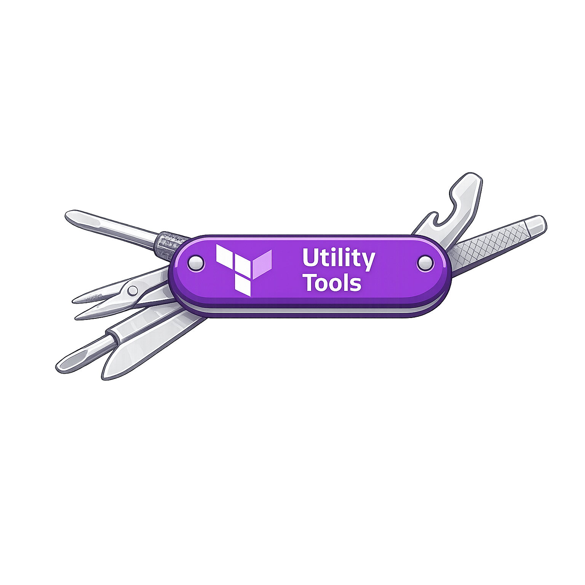

# Terraform Provider: Utility Tools
<p align="center">
  
</p>

A collection of pure functions for Terraform that fill gaps in the standard library — focused on map and object manipulation, filtering, and merging.

Requires Terraform >= 1.8.0 (provider functions support).

## Functions

### Maps & objects

| Function | Description |
|---|---|
| `pick(input, keys)` | Keep only the specified keys from a map or object |
| `omit(input, keys)` | Remove the specified keys from a map or object |
| `filter(input, conditions...)` | Keep entries whose attributes match any condition object |
| `nestedMerge(maps...)` | Deep merge — recursively combines nested objects, last-wins for all other types |

### Cleaning

| Function | Description |
|---|---|
| `compact(input)` | Remove null and empty string values from a list or map |
| `minimal(input)` | Remove null, empty strings, and empty collections from a list or map |
| `nestedCompact(input)` | Same as `compact`, but applied recursively to a nested map |
| `nestedMinimal(input)` | Same as `minimal`, but applied recursively to a nested map |

### Nesting & flattening

| Function | Description |
|---|---|
| `collapse(input, separator)` | Flatten a nested map into a single-level map with path-based keys |
| `expand(input, separator)` | Expand a flat path-keyed map back into a nested map |
| `combine(input)` | Cartesian product of map dimensions, returned as a flat map |
| `nestedCombine(input)` | Cartesian product of map dimensions, returned as a nested map |
| `nestedFilter(input, conditions...)` | Filter a nested map by leaf object attributes |

### Utilities

| Function | Description |
|---|---|
| `isNull(value)` | Returns `true` if the value is null |
| `isNotNull(value)` | Returns `true` if the value is not null |
| `trimext(path)` | Strip the last file extension from a path string |

## Usage

```terraform
terraform {
  required_providers {
    util = {
      source  = "Terraform-Utility-Tools/utility-tools"
    }
  }
  required_version = ">= 1.8.0"
}

provider "util" {}
```

Functions are called as `provider::util::<name>(...)`.

## Suggestions

Missing a function you'd find useful? [Open an issue](https://github.com/Terraform-Utility-Tools/terraform-provider-utility-tools/issues) with your suggestion.

## Development

**Requirements:** Go >= 1.24

```shell
# Build
go install

# Test
go test ./internal/provider/...

# Regenerate docs
cd tools && go generate ./...
```
